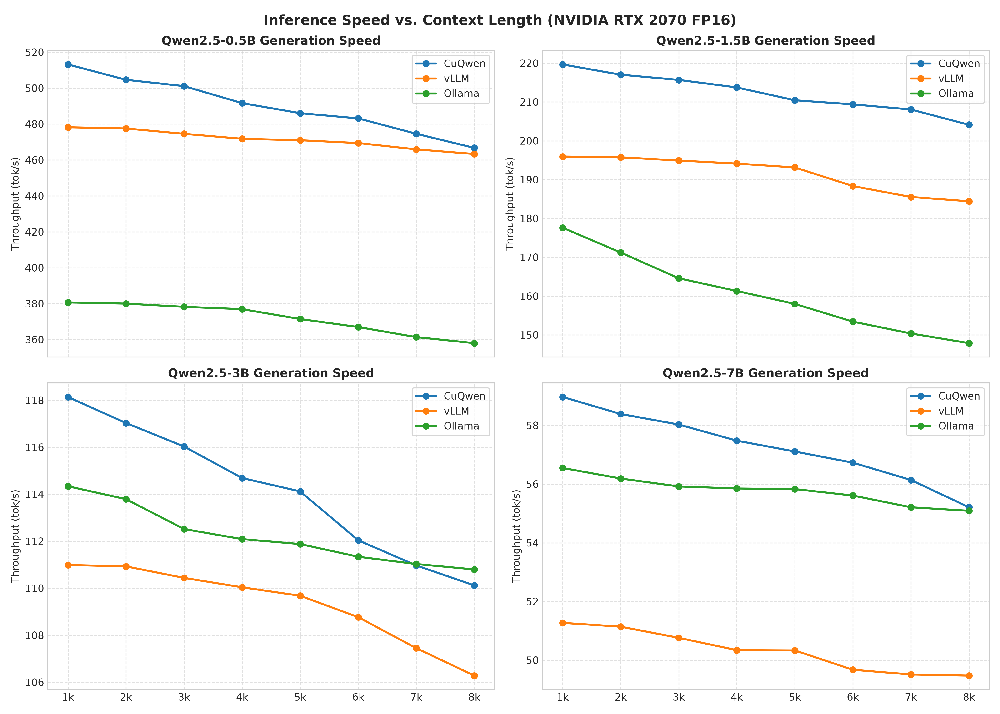
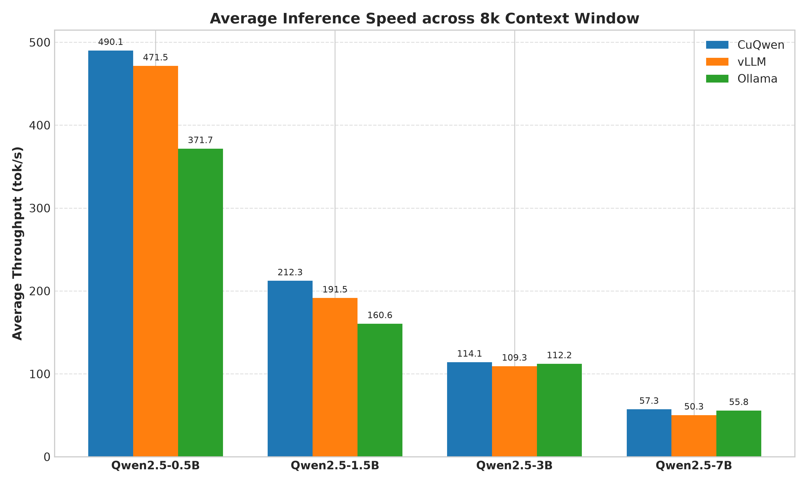
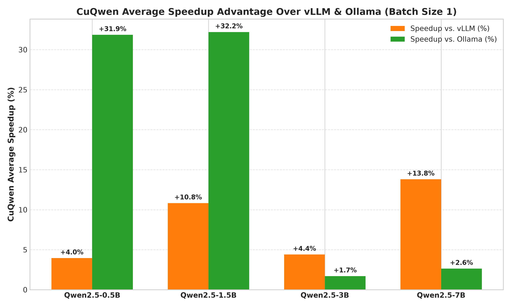
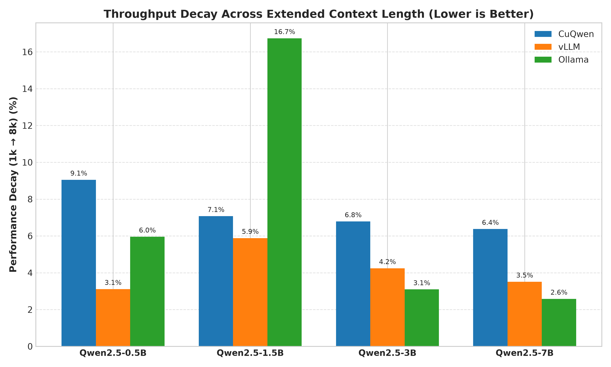

# CuQwen Benchmark Analysis

This document details the benchmarking methodology, hardware configuration, and performance analysis comparing **CuQwen** against industry-standard inference frameworks (**vLLM** and **Ollama**).

---

## Benchmarking Strategy & Hardware Setup

To evaluate bare-metal performance, CuQwen was tested in a head-to-head comparison against vLLM and Ollama using the **Qwen2.5** model family (`0.5B`, `1.5B`, `3B`, and `7B` sizes).

* **Hardware Target:** Cloud-rented **NVIDIA RTX 3090 (24GB VRAM)**.
  * *Note on Hardware Selection:* While local development was done on an NVIDIA GeForce RTX 2070 (8GB VRAM), running the Qwen2.5-7B model at full FP16 precision exceeds 8GB of VRAM when allocating memory. An RTX 3090 (24GB VRAM) was rented to evaluate all models under unconstrained FP16 conditions.
* **Precision:** Full FP16 model weights and FP16 Key-Value (KV) cache across all frameworks.
* **Batch Size:** Fixed at `1` (single-user interactive latency testing).
* **Context Window & Granularity:** Tested across an **8k context window**. Measurements were collected in **1k slice increments** ($0\rightarrow1\text{k}, 1\text{k}\rightarrow2\text{k}, \dots, 7\text{k}\rightarrow8\text{k}$) to track exact generation speed decay across context scaling.

---

## Benchmark Analysis

### 1. Throughput vs. Context Length (Context Decay)

* **Small Sequence Advantage:** CuQwen starts significantly faster than vLLM and Ollama in early context slices.
* **Sustained Lead:** Across all four model scales (`0.5B`, `1.5B`, `3B`, and `7B`), CuQwen maintains the highest generation speed through short-to-medium sequence lengths.

---

### 2. Average Throughput Across 8k Window

* **Raw Generation Efficiency:** CuQwen achieves higher average throughput across the entire 8k window on all model sizes.
* **Bandwidth Saturation:** On larger scales (`3B` and `7B`), CuQwen consistently operates near the physical memory bandwidth limits of the GPU, maintaining a baseline lead over Ollama and vLLM.

---

### 3. Average Speedup Advantage

* **Pronounced Low-Parameter Dominance:** CuQwen delivers its largest relative speedups on smaller model sizes (`0.5B` and `1.5B`) over Ollama.
* **Consistent Gain Over vLLM:** Across both small and large model sizes, CuQwen maintains a clear performance margin over vLLM, demonstrating the efficiency of specialized single-batch kernels.

---

### 4. Performance Decay Rate (1k → 8k Window)

* **Steeper Context Degradation:** CuQwen exhibits a higher throughput decay rate from 1k to 8k tokens compared to vLLM across almost all model scales, as context length expansion increases memory access overhead in the decode phase.
* **Outlier Behavior at Scale:** Ollama suffers an unusually sharp performance drop on the `1.5B` model, whereas CuQwen maintains a predictable, steady decay slope across all tested parameter counts.

---

## Key Performance Findings & Limitations

While CuQwen achieves faster generation speeds across all model scales, the benchmark reveals a clear architectural tradeoff:

1. **Peak Speed Superiority:** CuQwen dominates early token generation speed across both small and large model sizes.
2. **Context Length Throughput Degradation:** CuQwen exhibits a higher throughput decay rate (**6.4% to 9.1%**) compared to vLLM (**3.1% to 5.9%**) as sequence length scales from $1\text{k}$ to $8\text{k}$ tokens.
3. **Long-Context Projection:** Because production engines like vLLM utilize paged KV-cache management and advanced FlashDecode attention optimizations tuned for long sequences, CuQwen's steeper decay trajectory means that **at extreme context lengths (e.g., $16\text{k}+$ tokens), CuQwen's generation throughput will eventually fall behind vLLM and Ollama.**