# Optimization Journey: CuQwen 1.0

Local LLM execution has recently emerged, driven by open-weights models and efficient quantization techniques (AWQ, GPTQ, GGUF) making it easier to run Large language models on edge devices.

To see how far single-request generation can be pushed, I built **CuQwen**: a pure C++/CUDA inference engine written from scratch. The objective was to match or exceed the single-user token generation speed of production engines like ollma and vLLM.

## The Target: Qwen2.5 1.5B Architecture

Development begins with **Qwen2.5-1.5B-Instruct** before scaling the engine to support the 0.5B, 3B, and 7B variants and other Qwen series. All the development was done on my personal laptop having NVIDIA GeForce RTX 2070 (Turing architecture, `sm_75`).

## Theoretical Speed Limits: Back-of-the-Envelope Math

At FP16 precision, Qwen2.5 1.5B weights occupy ~3.0 GB of VRAM. During single-user autoregressive decode (Batch Size 1), generating each token requires streaming the entire weight set from global VRAM into registers.

Calculating the memory-bandwidth ceiling for the RTX 2070:

$$\text{Peak Theoretical Speed} = \frac{\text{Peak Bandwidth}}{\text{Model Size}} = \frac{448\text{ GB/s}}{3.0\text{ GB}} \approx 149.33\text{ tokens/sec}$$

In practice, achieving 100% bandwidth saturation is impossible without burning your GPU 😃 . The goal for CuQwen is to minimize hardware inefficiencies and reach as close to this theoretical limit.

## Execution Pipeline

Before writing custom CUDA kernels, mapping the exact data movement through GPU memory is essential. The execution flow divides into a macro view of the full forward pass and a micro view of the operations repeated across each layer.

### 1. High-Level Model Pipeline

Each generated token takes a single round-trip through five stages. The input token ID is resolved to a dense vector via an embedding lookup, then passed through a stack of 28 identical transformer layers that progressively refine its representation. A final RMSNorm stabilizes the output before an LM head GEMV projects it into vocabulary logits, and an ArgMax (or repetition-penalized sampling) selects the next token ID. At batch size 1, this entire forward pass runs sequentially for every token.

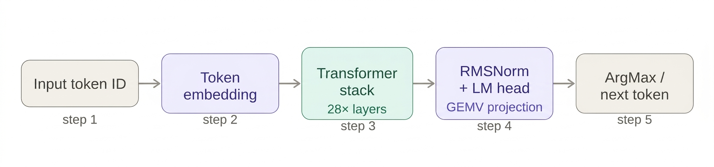

### 2. Single Transformer Layer Detail

Each of the 28 transformer layers runs two sub-blocks in sequence, connected by residual additions:

* **Attention Sub-Block:** Normalizes the input, computes Q/K/V projections, applies RoPE position encoding, and appends the new K and V vectors to the growing KV cache. It then executes Grouped-Query Attention (GQA) across all prior token positions before projecting the output back via $W_o$.
* **MLP Sub-Block:** Takes a second normalized copy of the state, expands it through gated (gate + up) projections, applies the SwiGLU activation function, and contracts the hidden representation back down using $W_{\text{down}}$.

Both sub-blocks skip-connect directly back to their respective layer inputs via residual connections.

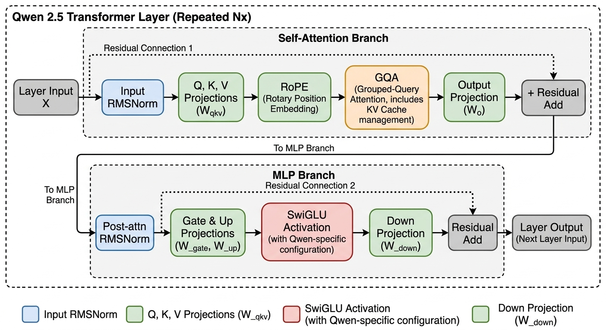

## Phase 1: The cuBLAS Baseline

Before chasing performance, establishing a correct baseline is essential to verify text coherence and produce measurable metrics to optimize against. Phase 1 focuses on building an end-to-end functional engine using standard primitives.

### The Hybrid Approach

To avoid premature optimization, standard libraries handled the initial heavy lifting. The seven weight projection matrix-vector operations per layer ($W_q$, $W_k$, $W_v$, $W_o$, $W_{\text{gate}}$, $W_{\text{up}}$, $W_{\text{down}}$) are offloaded to **cuBLAS**. At Batch Size 1, these execute as FP16 GEMV operations with FP32 compute accumulation to ensure numerical stability without incurring FP32 memory bandwidth penalties.

All non-GEMV operations are implemented using basic custom CUDA kernels:
* RMSNorm
* Rotary Position Embedding (RoPE)
* SwiGLU Activation
* Grouped-Query Attention (GQA)
* ArgMax Sampling & Repetition Penalty

*Note: In Phase 1, prompt prefill shares the single-token decode execution path. While suboptimal for long prompt processing, this simplifies initial engine architecture and ensures benchmarks measure pure decode throughput from token zero.*

### Baseline Performance & Benchmarks

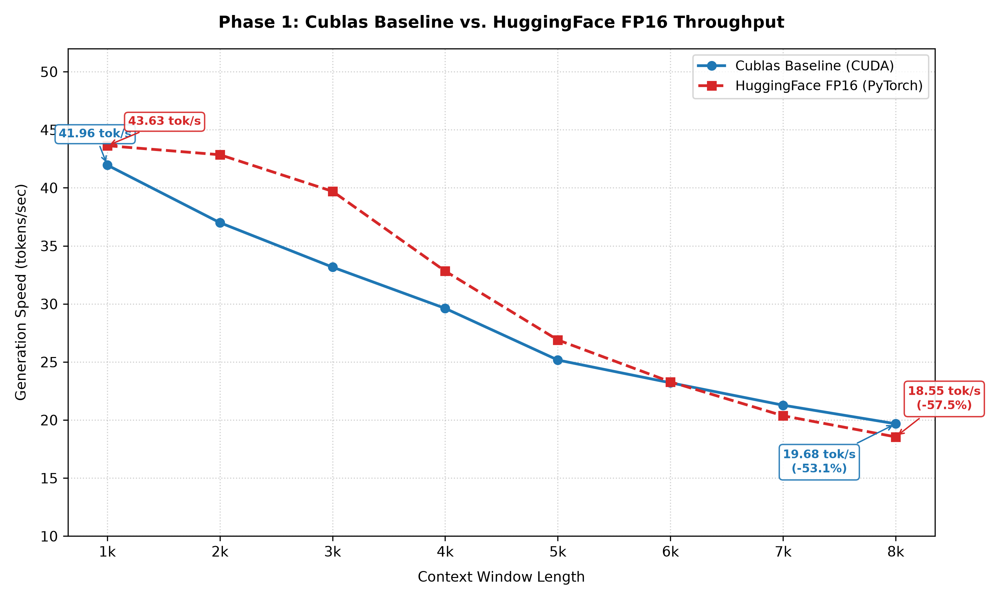

CuQwen was benchmarked against HuggingFace Transformers (FP16, PyTorch) on the RTX 2070 by generating 8,000 continuous tokens and recording throughput in 1,000-token context intervals.

At short contexts (1k tokens), CuQwen achieves **41.96 tok/s** compared to HuggingFace's **43.63 tok/s**. As context length increases, throughput degrades across both engines due to expanding KV-cache attention operations.

Across the full 8k sequence length:
* **CuQwen Average:** 28.88 tok/s (53.1% throughput decay across 8k context)
* **HuggingFace Average:** 31.02 tok/s (57.5% throughput decay across 8k context)

The baseline trails HuggingFace by 7% on average, establishing a stable floor for subsequent kernel-level optimizations and fusions.

## Phase 2: Custom Fused Kernels (And Why They Slowed Things Down)

Phase 2 aimed to eliminate global memory round-trips by replacing cuBLAS GEMVs and standalone operations with custom fused kernels. In theory, keeping intermediate activations in shared memory and registers should yield an immediate speedup. In practice, initial implementation resulted in a **38% performance drop**.

### The Overhead of Phase 1

The Phase 1 pipeline executed operations as discrete, isolated steps:

1. **RMSNorm** reads the hidden state and writes a normalized vector to VRAM.
2. **cuBLAS** reads the normalized vector, computes Q/K/V projections, and writes three distinct output vectors to VRAM.
3. **RoPE Kernel** reads those vectors back, performs rotation in-place, and writes them to VRAM once more.

This constant global memory round-tripping wastes precious VRAM bandwidth. Furthermore, launching 10+ individual kernels per transformer layer introduces non-trivial CPU dispatch latency and launch overhead.

### Kernel Reorganization & Fusion Design

The layer pipeline was consolidated into four main custom kernel launches per layer:

* **Fused Attention Input Block:** Combines RMSNorm, Q/K/V projections, bias addition, and RoPE positioning into a single execution step. Thread blocks perform shared-memory reductions for RMSNorm, compute projection dot products, and apply RoPE before committing results to VRAM.
* **Fused Output Projection + Residual:** Merges $W_o$ GEMV and residual addition. The output vector dot product accumulates in shared memory, adds the layer input residual, and writes once to global memory.
* **Fused MLP Stage 1:** Unifies post-attention RMSNorm, dual gate/up projections, and the SwiGLU activation. Each block recomputes RMSNorm, executes gate and up dot products concurrently, applies SwiGLU, and writes out the combined activation.
* **Fused MLP Stage 2:** Fuses $W_{\text{down}}$ contraction and the secondary residual addition, matching the implementation structure of the $W_o$ stage.

This design reduced kernel launches from **17 per layer to 5** (in transformer block) and retained intermediate activations within on-chip registers and shared memory.

### Benchmark Results

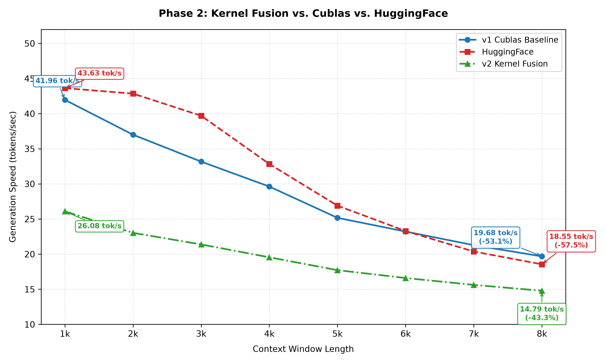

* **1k Context Throughput:** Drops from **41.96 tok/s** (Phase 1) to **26.08 tok/s** (Phase 2).
* **8k Context Throughput:** Drops from **19.68 tok/s** (Phase 1) to **14.79 tok/s** (Phase 2).

### Failure Analysis & Next Steps

The performance regression stems directly from matrix-vector dot product efficiency:

* **Assembly-Level Tuning:** cuBLAS uses highly optimized, micro-architecturally tuned SASS assembly instruction sequences tailored for specific execution units.
* **Naive CUDA Loop Patterns:** Phase 2's custom GEMV loops lacked warp-level memory coalescing, vectorization (`uint4`/`float4`), and instruction-level parallelism.

While slower, Phase 2 successfully decoupled the inference engine from cuBLAS dependencies. The execution pipeline, memory layout, and fusion structures are now established, creating a clean target for low-level kernel optimization.

## Phase 3: Memory Access Optimizations & 128-Bit Vectorization

Phase 2 established a clean, custom kernel architecture that eliminated cuBLAS and slashed kernel launch overhead, but at a severe throughput penalty (~19.35 tok/s average). While fusion reduced DRAM round-trips for intermediate activations, the first-pass custom GEMV and attention kernels were severely memory-bandwidth starved.

By issuing standard 16-bit scalar loads (`half`), threads flooded the GPU memory controller with millions of tiny, fragmented memory requests. Phase 3 targets memory bandwidth efficiency directly by restructuring every custom kernel across the pipeline to utilize **128-bit vectorized memory transactions** and **strict memory coalescing**.

### Fixing the Memory Bottleneck

To push execution closer to the RTX 2070's theoretical peak memory bandwidth (448 GB/s), every core kernel pipeline was overhauled (`launch_embedding_lookup`, `launch_fused_attn_block`, `launch_gqa_attention`, `launch_fused_mlp_stage1`, `launch_fused_mlp_stage2`, and `launch_fused_rmsnorm_logits`):

* **128-Bit Vectorized Loading:** Instead of issuing individual 16-bit (`half`) scalar requests, weight and activation pointers were cast to 128-bit types (`float4`). Utilizing a 128-bit memory conversion structure (a custom `Vector128` union containing four `half2` pairs), each thread now issues a single instruction to load **8 contiguous FP16 elements (16 bytes)** simultaneously. This dramatically reduces instruction issue overhead and keeps memory execution pipelines fully saturated.
* **Coalesced Memory Transactions:** Thread indexing and loop stride steps across all GEMV and GQA kernels were strictly aligned to warp boundaries (32 threads). Adjacent threads within a warp read contiguous 16-byte memory segments from global VRAM, enabling the GPU memory subsystem to coalesce an entire warp's memory access into a single, unified VRAM transaction.

### Benchmark Results

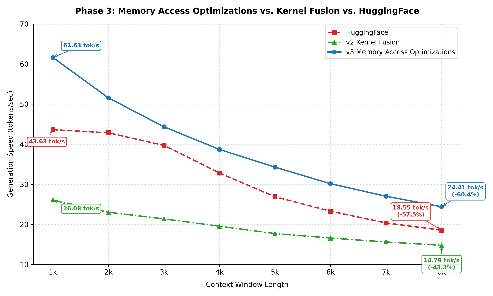

Optimizing memory access patterns yielded massive performance gains across all context lengths:

* **1k Context:** Throughput jumped from **26.08 tok/s** (Phase 2) to **61.63 tok/s**—a 2.36x improvement over the fused baseline and 41% faster than HuggingFace FP16 (43.63 tok/s).
* **8k Context:** Generation speed maintained **24.41 tok/s**, outperforming HuggingFace (18.55 tok/s) at the same sequence length.
* **Overall Average (8k Run):** Phase 3 averaged **39.01 tok/s**, surpassing the Phase 1 cuBLAS baseline (**28.88 tok/s**) and HuggingFace/PyTorch (**31.02 tok/s**).

## Phase 4: Warp-Level Primitives & Loop Unrolling

With global VRAM bandwidth bottlenecks resolved via 128-bit memory vectorization in Phase 3, the bottleneck shifted to internal instruction execution latencies and intra-block synchronization stalls. Phase 4 focuses on low-level compute hygiene: replacing dynamic shared memory reductions with warp shuffle primitives and eliminating loop branching overheads.

### Core Optimization Concepts

* **Warp-Level Shuffle Reductions:** Traditional thread block reductions rely on shared memory allocation and explicit `__syncthreads()` barrier calls. The reduction pipelines across all fused blocks were overhauled using dedicated `warp_reduce_sum` and `warp_reduce_max` primitives built on `__shfl_down_sync` register shuffle instructions. Threads within the same 32-thread warp exchange values directly at register speed. Shared memory usage was reduced to just 32 floats per block to bridge final warp outputs, eliminating `__syncthreads()` barrier latency.
* **Loop Unrolling:** Standard loops introduce instruction overhead by evaluating termination conditions and incrementing counters on every iteration. Applying `#pragma unroll 4` and `#pragma unroll 8` directives across matrix-vector multiplications, Softmax normalizations, and SwiGLU activations allows the compiler to inline loop bodies. This enables the instruction scheduler to pipeline math operations back-to-back, hiding instruction latency.

### Benchmark Results

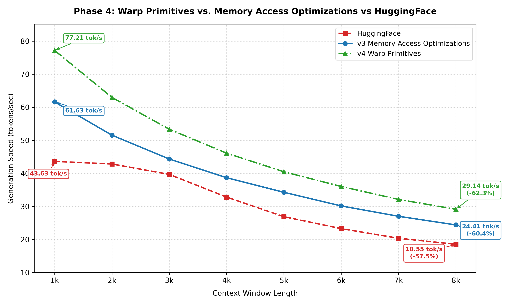

Optimizing intra-warp synchronization and instruction pipelining yielded significant throughput improvements across all sequence lengths:

* **1k Context:** Throughput increased to **77.21 tok/s** (up from Phase 3's **61.63 tok/s**), outperforming PyTorch/HuggingFace (**43.63 tok/s**).
* **8k Context:** Generation speed maintained **29.14 tok/s**, compared to Phase 3 (**24.41 tok/s**) and HuggingFace (**18.55 tok/s**).
* **Throughput Advantage:** At 8k context length, Phase 4 runs **57% faster** than the baseline PyTorch implementation.

Eliminating barrier latencies and loop branching freed streaming multiprocessors (SMs) to process vectorized memory payloads with minimal idle cycles.

## Phase 5: FlashDecode & Head-Major KV Cache Optimization

While Phase 4 pushed short-context throughput to **77.21 tok/s**, the engine still experienced throughput decay as context expanded. By token 8,000, generation speed dropped to **29.14 tok/s**—a 62.3% degradation from peak throughput. 

Phase 5 targets this long-context decode bottleneck to achieve flat execution scaling across expanding sequence windows.

### The Bottleneck: Autoregressive Attention Scaling

During single-user autoregressive decoding (Batch Size 1), every newly generated token must attend to all historical keys and values stored in the KV cache. Profiling the Phase 4 pipeline under long context lengths revealed two core bottlenecks:

* **Scattered Memory Layout:** Non-contiguous KV cache layouts required strided memory writes at each generation step, incurring host launch overhead and non-coalesced VRAM access.
* **Single-Block Compute Saturation:** Standard decode attention assigns a single thread block to sequentially scan the past context per query head from $t=0$ to $t=currentPosition$. As sequence length scales, this single thread block becomes compute and memory-bound, causing linear $O(N)$ performance degradation.

### The Solution: Head-Major Layout & 2-Stage FlashDecode

To resolve context scaling degradation, the VRAM cache layout was restructured and a Split-K parallel attention algorithm inspired by FlashDecode was implemented.

* **Head-Major KV Cache Layout:** The KV cache was reorganized into a contiguous `[n_layers, n_kv_heads, max_seq_len, head_dim]` tensor structure. New keys and values are committed via single, contiguous vectorized memory writes per KV head at offset `pos`.
* **2-Stage FlashDecode (Split-K Parallel Attention):** Instead of processing sequence history sequentially within a single block, FlashDecode splits the context dimension into fixed context tiles (`tile_size = 256`).
  * **Stage 1 (Parallel Tile Reduction):** Multiple thread blocks launch concurrently across query heads and context tiles. Each block calculates local query-key dot products using vectorized 128-bit loads, computes partial softmax max/sum metrics, and writes partial value vectors to temporary workspace memory.
  * **Stage 2 (Log-Space Rescaling & Merge):** A lightweight second stage uses a single warp per query head to rescan partial tile results using global max scaling, normalizes them in log-space, and merges them into the final attention output vector.

### Benchmark Results

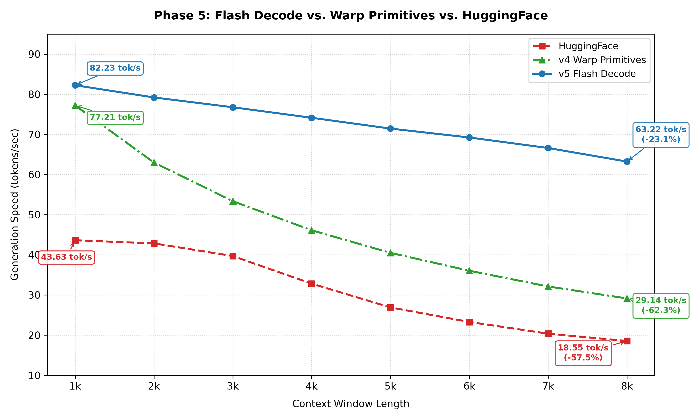

FlashDecode and head-major cache indexing flattened the long-context performance decay curve:

* **1k Context:** Peak throughput reached **82.23 tok/s** (up from Phase 4's **77.21 tok/s**), running nearly **1.9x faster** than PyTorch/HuggingFace FP16 (**43.63 tok/s**).
* **8k Context:** Throughput maintained **63.22 tok/s**, compared to Phase 4 (**29.14 tok/s**) and HuggingFace (**18.55 tok/s**)—delivering **2.17x the speed** of Phase 4 and **3.4x the speed** of PyTorch.
* **Minimal Performance Decay:** Across the 1k to 8k context window, Phase 5 suffered only a **23.1% throughput reduction**, compared to **62.3%** in Phase 4 and **57.5%** in PyTorch/HuggingFace.

By parallelizing attention reduction across CUDA thread blocks, context scaling overhead is mitigated, resulting in consistent auto-regressive decode speeds up to 8,000 tokens.

## Phase 6: Kernel Profiling & Targeted Optimizations

After five optimization cycles, CuQwen had evolved into a fully custom CUDA engine with fused kernels, 128-bit vectorized memory access, warp-level primitives, and FlashDecode attention. At an 8,000-token context, generation speed reached **63.22 tok/s**—over $3\times$ faster than HuggingFace FP16. 

Given the theoretical RTX 2070 ceiling of **149.33 tok/s**, Phase 6 investigates remaining hardware bottlenecks through deep profiling.

### Profiling with Nsight Systems

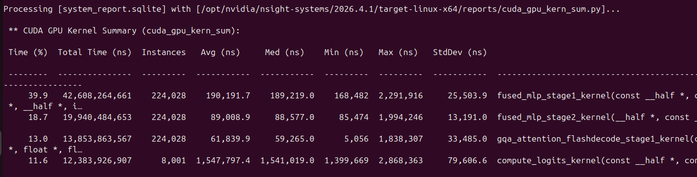

Nsight Systems was executed across a full 8,000-token generation run to profile GPU execution time breakdown across kernels:

| Kernel | Time (%) | Avg Duration |
| :--- | :--- | :--- |
| `fused_mlp_stage1` | 39.9% | 190 µs |
| `fused_mlp_stage2` | 18.7% | 89 µs |
| `gqa_attention_flashdecode_stage1` | 13.0% | 62 µs |
| `compute_logits` | 11.6% | 1,548 µs |

The MLP kernels combined consumed **58.6%** of total execution time. With attention already optimized via FlashDecode, profiling targeted the three non-attention performance bottlenecks.

### Deep Dive: Nsight Compute

Nsight Compute analysis revealed key memory and compute pipeline bottlenecks:

* **`fused_mlp_stage1` (68% DRAM Throughput, 54% Compute Throughput):** The kernel was memory-bound due to redundant data accesses. The input vector $x$ (1,536 elements) was loaded twice: once during the RMSNorm sum-of-squares pass and once during the dual gate/up GEMV projection. Additionally, reduction logic executed two sequential warp-reduction loops for gate and up accumulators rather than a unified pass.

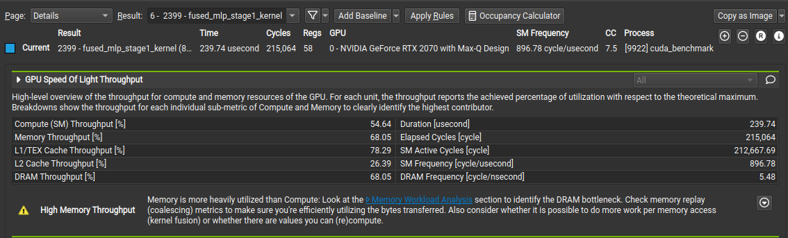

* **`fused_mlp_stage2` (83% DRAM Throughput, 20% Compute Throughput):** Suffered severe memory pipeline stalls. `intermediate_in` (8,960 FP16 values, ~17.5 KB) was loaded independently by all 1,536 output-row blocks, resulting in redundant global memory fetches without cross-block data reuse.

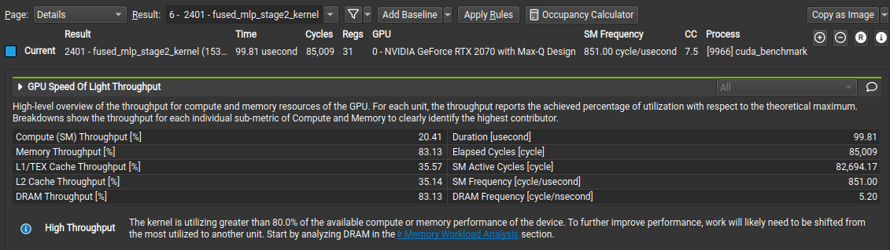

* **`compute_logits` (73% DRAM Throughput, 42% Compute Throughput):** `x_normed` (1,536 FP16 values, ~3 KB) was loaded independently by 151,936 vocabulary output blocks, leading to low arithmetic intensity relative to global memory traffic.

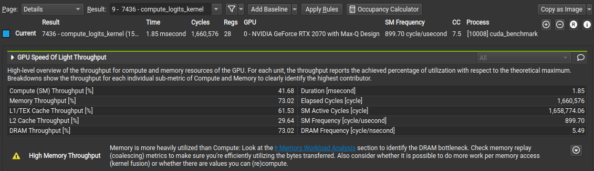

### Targeted Optimizations: Row Tiling & Single-Pass Reductions

To eliminate redundant global memory reads and improve arithmetic intensity, the target kernels were restructured:

* **Fused Dual-Warp Reductions & Cache Instructions (`fused_mlp_stage1`):** Combined the gate and up accumulator reductions into a single warp-shuffle loop using `__shfl_down_sync`, halving reduction instruction overhead. Weight reads were routed through the read-only texture cache path via `__ldg()`, and math operations were mapped to `__fmaf_rn()` primitives to maintain floating-point fused multiply-add pipeline saturation.
* **Row Tiling (`fused_mlp_stage2` & `compute_logits`):** Transformed thread block mapping from 1 output row per block to **4 rows per block (tile size = 4)**. Thread blocks load the shared input operand (`intermediate_in` or `x_normed`) once into registers and evaluate dot products across 4 weight rows simultaneously in the inner loop. 
  * **Arithmetic Intensity:** Multiplied arithmetic intensity by $4\times$ for the shared operand.
  * **Grid Scaling:** Reduced grid sizes from 1,536 to **384 blocks** (`fused_mlp_stage2`) and from 151,936 to **~38,000 blocks** (`compute_logits`), lowering block dispatch overhead.

### Benchmark Results

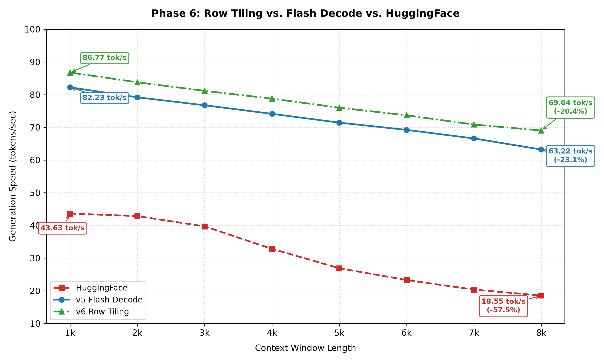

Row tiling and reduction optimizations delivered consistent performance gains across all context lengths:

* **1k Context:** Throughput increased from **82.23 tok/s** (Phase 5) to **86.77 tok/s**.
* **8k Context:** Throughput reached **69.04 tok/s** (up from Phase 5's **63.22 tok/s**), representing a **9.2% speedup** at long context window lengths.
* **Reduced Throughput Decay:** Performance decay across the 1k to 8k window dropped to **20.4%** (compared to Phase 5's **23.1%**).

Targeting DRAM-stalled kernels restructured execution from memory bandwidth bottlenecking toward balanced compute and memory utilization across the pipeline.

## Phase 7: CUDA Graphs & Launch Overhead Elimination

After Phase 6 eliminated memory stalling within individual kernels, execution bottlenecks shifted to the host-device boundary. Kernels were executing so quickly that the CPU overhead of repeatedly scheduling and enqueuing operations became a measurable limit on token generation speed.

### The Bottleneck: Host CPU Launch Latency

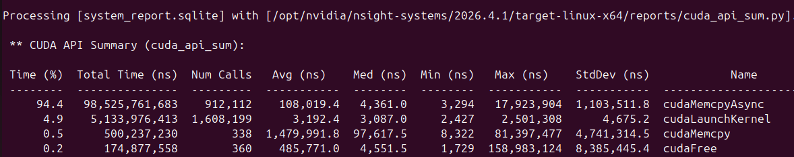

In Phase 6, generating 8,000 tokens required issuing individual CUDA kernel launches layer-by-layer on every decode iteration:

* **Total `cudaLaunchKernel` Calls:** 1,608,199 calls across an 8,000-token sequence.
* **Host Launch Overhead:** Consumed **5.13 seconds** of total host scheduling time.
* **Average Launch Latency:** ~3.19 µs per call.

At high generation speeds, calling `cudaLaunchKernel` 200+ times per token caused the CPU to spend critical microseconds context-switching and enqueuing work rather than keeping GPU pipelines continuously saturated.

### The Solution: Static CUDA Graph Capture and Replay

To eliminate host dispatch overhead during single-batch autoregressive generation, Phase 7 encapsulates the entire 28-layer Transformer forward pass into a static CUDA Graph:

* **Graph Capture:** During the initial decode step, the engine records the execution flow directly on the GPU—linking memory dependencies, grid launches, and kernel execution order into a single execution graph.
* **Graph Replay:** On all subsequent decode steps, the CPU updates step-specific parameters (such as the current sequence position) and issues a single `cudaGraphLaunch` API call per generated token.

This design enables the GPU to execute the pre-configured workflow directly from hardware work queues without waiting for step-by-step CPU instruction dispatches.

#### Launch Overhead Reduction

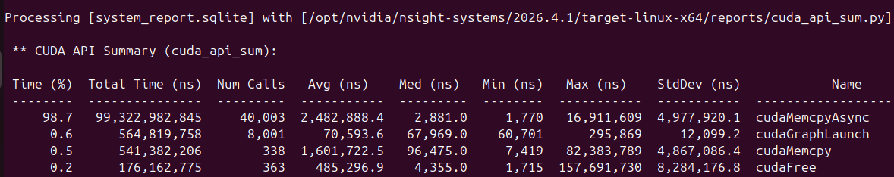

* **Kernel Dispatch Calls:** Dropped from **1,608,199** to **8,001** `cudaGraphLaunch` calls (1 call per generated token).
* **Launch Management Overhead:** Decreased from **5.13 seconds** to **0.56 seconds**—eliminating **>89%** of host launch latency.

### Benchmark Results

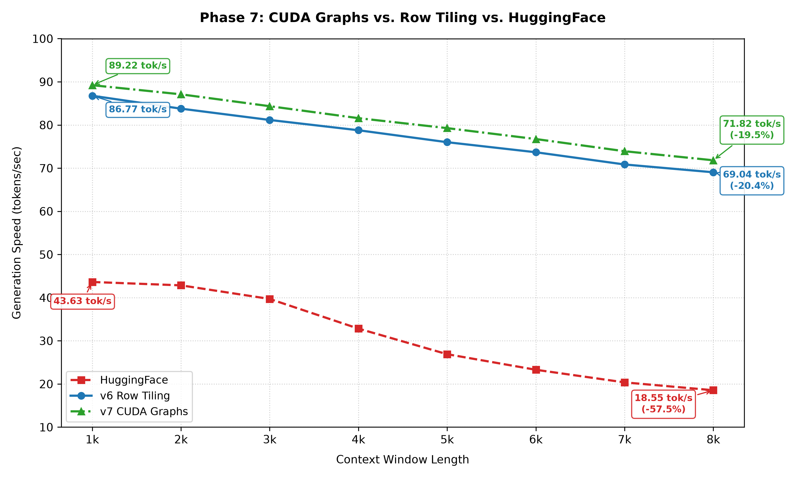

Removing host CPU dispatch bottlenecks provided clean throughput gains across all context lengths:

* **1k Context:** Throughput increased from **86.77 tok/s** (Phase 6) to **89.22 tok/s**.
* **8k Context:** Generation speed increased from **69.04 tok/s** to **71.82 tok/s**—achieving a **3.87x speedup** over PyTorch/HuggingFace FP16 (**18.55 tok/s**).

Combining row-tiled kernel execution with single-call CUDA Graph execution ensures that host-side instruction dispatch no longer starves GPU execution pipelines.

## Conclusion: Reflecting on the Optimization Journey

Building CuQwen from bare-metal CUDA kernels up to a fully optimized inference engine highlights the impact of systematically targeting hardware bottlenecks. What began as a baseline cuBLAS implementation lagging behind PyTorch eventually transformed into an engine delivering an average of **80.50 tok/s** across an 8,000-token sequence window.

Across all seven phases, key architectural shifts drove these performance jumps:

* **Phase 1 (cuBLAS Baseline):** Established an initial working floor of **28.88 tok/s** average, identifying standard GEMV dependencies and baseline memory traffic patterns.
* **Phase 2 (Naive Custom Fusion):** Regressed to **19.35 tok/s** average, proving that kernel fusion alone without hardware-aligned memory patterns yields poor throughput due to naive loop structures.
* **Phase 3 (128-Bit Memory Vectorization):** Rebounded to **39.01 tok/s** average by restructuring VRAM transactions into coalesced 16-byte `float4` vector loads, resolving global memory bandwidth starvation.
* **Phase 4 (Warp Primitives & Unrolling):** Advanced to **47.18 tok/s** average, replacing shared memory barriers (`__syncthreads()`) with `__shfl_down_sync` warp shuffle reductions and unrolling inner loops to hide instruction latency.
* **Phase 5 (FlashDecode & Head-Major Cache):** Flattened the long-context performance decay curve, parallelizing attention reductions via Split-K tiling to sustain high throughput out to 8,000 tokens.
* **Phase 6 (Row Tiling & Texture Caching):** Re-architected MLP and logit kernels to compute multiple output rows per block, dramatically increasing arithmetic intensity per byte loaded.
* **Phase 7 (CUDA Graph Execution):** Eliminated host CPU dispatch latency, reducing over 1.6 million runtime `cudaLaunchKernel` calls down to single-replay graph launches per generated token.

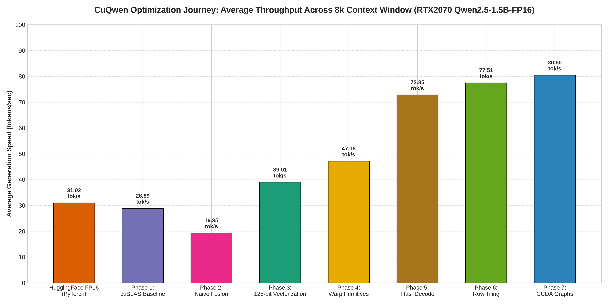
