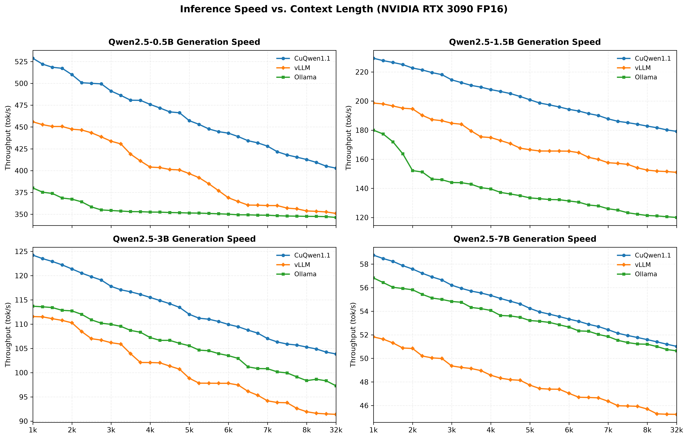
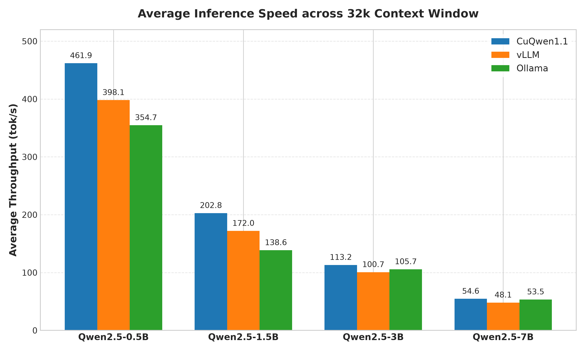
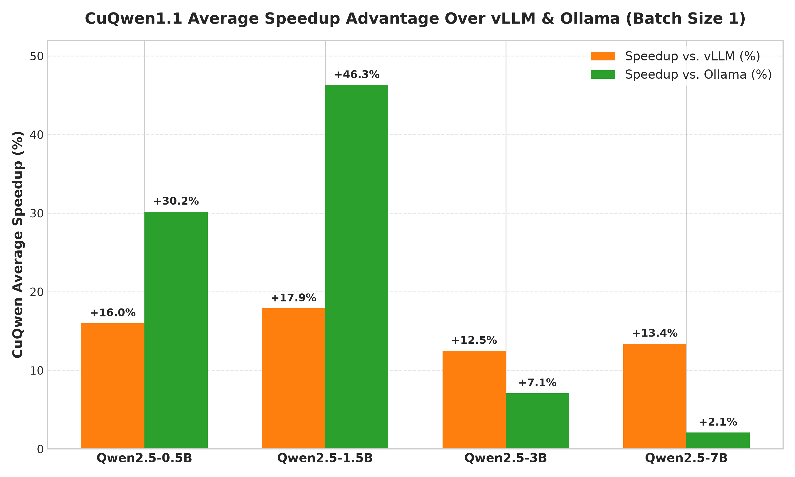
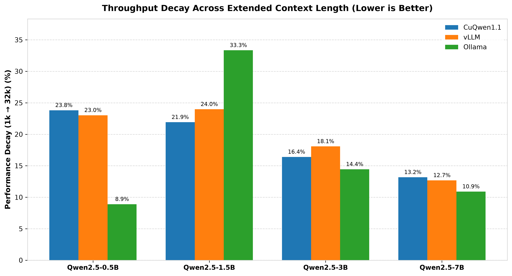

# CuQwen 1.1 Benchmark Analysis

This document details the benchmarking methodology, hardware configuration, and performance analysis comparing **CuQwen 1.1** against industry-standard inference frameworks (**vLLM** and **Ollama**) across an extended long-context window.

> For the details of the long-context optimizations that produced these results, see the [CuQwen 1.1 Optimization](https://github.com/talhatahir-10xe/CuQwen/blob/release1.1/docs/RELEASE_1.1_OPTIMIZATION.md) document.

---

## Benchmarking Strategy & Hardware Setup

To evaluate bare-metal performance, CuQwen 1.1 was tested in a head-to-head comparison against vLLM and Ollama using the **Qwen2.5** model family (`0.5B`, `1.5B`, `3B`, and `7B` sizes).

* **Hardware Target:** Cloud-rented **NVIDIA RTX 3090 (24GB VRAM)**.
  * *Note on Hardware Selection:* While local development was done on an NVIDIA GeForce RTX 2070 (8GB VRAM), running the Qwen2.5-7B model at full FP16 precision exceeds 8GB of VRAM when allocating memory. An RTX 3090 (24GB VRAM) was rented to evaluate all models under unconstrained FP16 conditions.
* **Precision:** Full FP16 model weights and FP16 Key-Value (KV) cache across all frameworks.
* **Batch Size:** Fixed at `1` (single-user interactive latency testing).
* **Context Window & Granularity:** Tested across an extended **32k context window**. Measurements were collected in **1k slice increments** ($0\rightarrow1\text{k}, 1\text{k}\rightarrow2\text{k}, \dots, 31\text{k}\rightarrow32\text{k}$) to track exact generation speed decay across context scaling.

---

## Benchmark Analysis

### 1. Throughput vs. Context Length (Context Decay)

* **Small Sequence Advantage:** CuQwen 1.1 starts significantly faster than vLLM and Ollama in early context slices.
* **Sustained Long-Context Lead:** Across all four model scales (`0.5B`, `1.5B`, `3B`, and `7B`), CuQwen 1.1 now holds the highest generation speed all the way out to the 32k window, rather than being overtaken at long context as in the 1.0 release. The curve stays flat because the reworked decode-phase attention keeps per-token cost nearly constant as the KV cache grows.

---

### 2. Average Throughput Across 32k Window

* **Raw Generation Efficiency:** CuQwen 1.1 achieves the highest average throughput across the entire 32k window on all model sizes — **461.9 tok/s** (`0.5B`), **202.8 tok/s** (`1.5B`), **113.2 tok/s** (`3B`), and **54.6 tok/s** (`7B`).
* **Bandwidth Saturation:** On larger scales (`3B` and `7B`), CuQwen consistently operates near the physical memory bandwidth limits of the GPU, maintaining a baseline lead over Ollama and vLLM even at extreme context lengths.

---

### 3. Average Speedup Advantage

* **Pronounced Low-Parameter Dominance:** CuQwen 1.1 delivers its largest relative speedups on smaller model sizes, reaching **+46.3%** over Ollama and **+17.9%** over vLLM on the `1.5B` model.
* **Consistent Gain Over vLLM:** Across every model size, CuQwen maintains a clear margin over vLLM (**+12.5% to +17.9%**), demonstrating the efficiency of specialized single-batch kernels — now sustained across the full 32k window.

---

### 4. Performance Decay Rate (1k → 32k Window)

* **Competitive Context Degradation:** CuQwen 1.1's throughput decay from 1k to 32k tokens is now on par with vLLM — and lower than vLLM on the `1.5B` (**21.9%** vs `24.0%`) and `3B` (**16.4%** vs `18.1%`) models. This closes the long-context gap that defined the 1.0 release.
* **Outlier Behavior at Scale:** Ollama still suffers an unusually sharp drop on the `1.5B` model (`33.3%`), whereas CuQwen maintains a predictable, steady decay slope across all tested parameter counts.

---

## Key Performance Findings

CuQwen 1.1 delivers faster generation speeds across all model scales **and** resolves the long-context tradeoff that limited the 1.0 release:

1. **Peak Speed Superiority:** CuQwen dominates early token generation speed across both small and large model sizes.
2. **Sustained Long-Context Throughput:** By reworking the decode-phase attention over the KV cache, CuQwen 1.1 cuts its throughput decay to **13.2% – 23.8%** across the 1k → 32k window (down from **22.5% – 45.2%** in 1.0), bringing it in line with vLLM's **12.7% – 24.0%**.
3. **Highest Average Throughput at 32k:** Unlike CuQwen 1.0 — whose steeper decay caused it to fall behind vLLM and Ollama at extreme context lengths — CuQwen 1.1 now retains the highest average throughput across the full 32k window on every model size.
