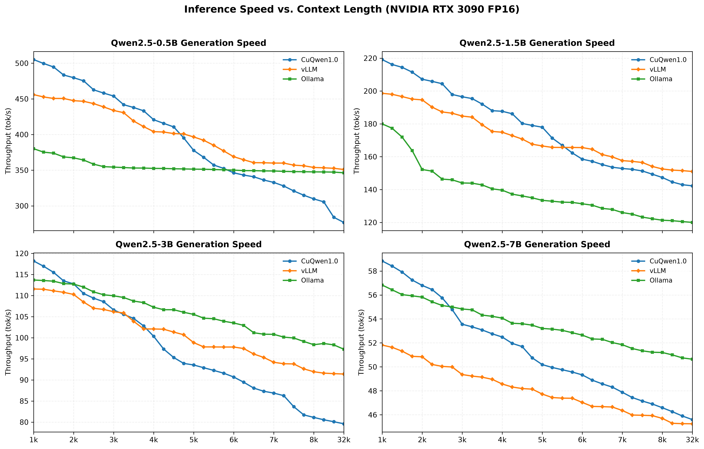
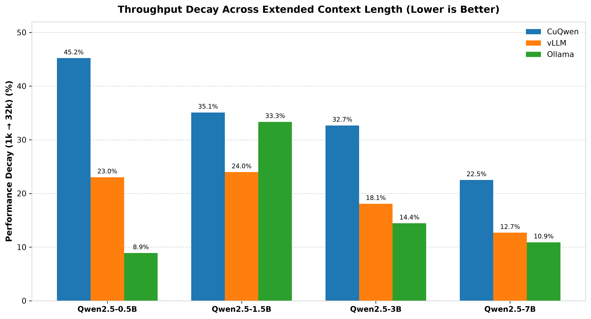
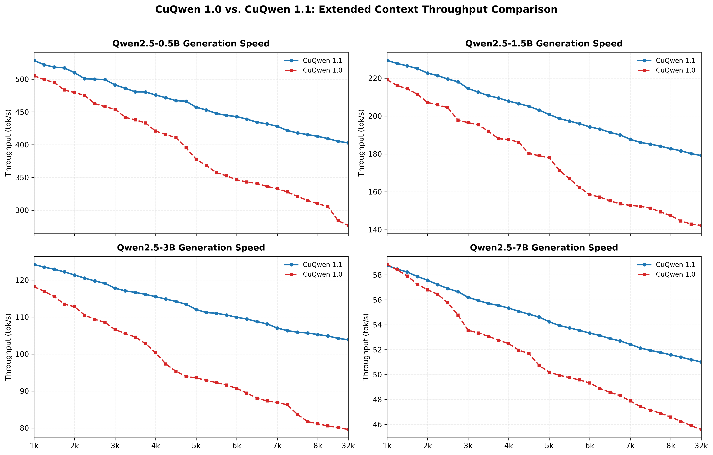
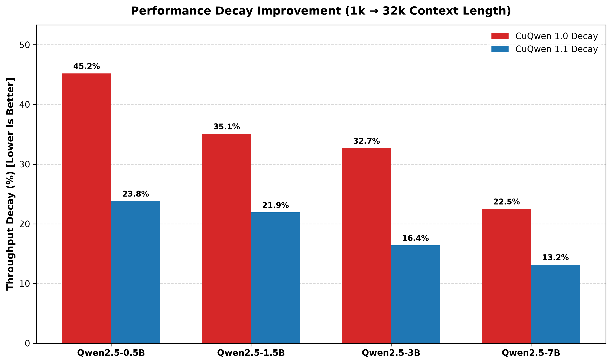

# CuQwen 1.1 Optimization: Long-Context Throughput

This document covers the optimization work done in **CuQwen 1.1**, whose single goal was to fix the biggest limitation of CuQwen 1.0: **throughput decay on long context windows**.

---

## The Problem: CuQwen 1.0 Fell Behind on Long Contexts

CuQwen 1.0 was the fastest engine on short-to-medium sequences, but its generation speed dropped off faster than the competition as the context grew. Once the context window stretched toward 32K tokens, that steeper slope let both vLLM and Ollama catch up and, in several cases, overtake CuQwen 1.0.

The two charts below were recorded on an **NVIDIA RTX 3090** across a **32K context window** and make the issue clear.

### Throughput vs. Context Length (CuQwen 1.0)

CuQwen 1.0 (blue) launches ahead on every model size, but its curve descends more steeply than vLLM and Ollama. By the far end of the 32K window it has crossed under one or both competitors on the `0.5B`, `3B`, and `7B` models — exactly where a long-context engine needs to stay ahead.

### Performance Decay Rate (CuQwen 1.0)

Measured as the throughput lost from the 1K slice to the 32K slice, CuQwen 1.0's decay was severe — **45.2%** on `0.5B`, **35.1%** on `1.5B`, **32.7%** on `3B`, and **22.5%** on `7B` — consistently worse than vLLM's decay. This steep decay, not raw peak speed, was the real weakness to solve.

---

## The Optimization Strategy

The long-context slowdown came almost entirely from the decode-phase attention over the KV cache. CuQwen 1.1 reworks that path with three changes:

* **Fixed-partition FlashDecoding.** CuQwen 1.0 split the KV cache into fixed 256-token chunks, so the number of parallel partitions (and the reduction/launch overhead) grew with the context length. CuQwen 1.1 instead uses a **fixed number of partitions** that each absorb a proportionally larger slice as context grows, keeping GPU occupancy and reduction cost roughly constant regardless of sequence length.
* **Tensor-core attention.** The attention score and output math in the decode step now runs on the GPU's **Tensor Cores (WMMA)** instead of regular CUDA cores, raising the arithmetic throughput of the exact stage that scales with context.
* **GQA-aware head grouping.** Query heads that share a KV head are processed together, so each key/value entry is read from the KV cache **once and reused across the whole group** — cutting the memory-bandwidth traffic that dominates long-context decoding.

Together these flatten the throughput curve: the work per generated token grows far more gently with context, which directly attacks the decay rate.

---

## The Result: A Much Flatter Curve

The two charts below compare CuQwen 1.1 against CuQwen 1.0 over the same 32K context window on the RTX 3090.

### CuQwen 1.0 vs. 1.1 Throughput

CuQwen 1.1 (blue) sits above CuQwen 1.0 (red) at every context length on all four model sizes, and — more importantly — its curve declines far more gradually. The gap between the two versions widens as the context grows, which is exactly the long-context region where 1.0 struggled.

### CuQwen 1.0 vs. 1.1 Decay Rate

The decay rate over the 1K → 32K window drops sharply across the board:

| Model Size | CuQwen 1.0 Decay | CuQwen 1.1 Decay |
| ---------- | ---------------- | ---------------- |
| 0.5B       | 45.2%            | **23.8%**        |
| 1.5B       | 35.1%            | **21.9%**        |
| 3B         | 32.7%            | **16.4%**        |
| 7B         | 22.5%            | **13.2%**        |

CuQwen 1.1 nearly halves the throughput decay on the smaller models and cuts it substantially on the larger ones. This brings CuQwen's long-context decay in line with — and on the `1.5B` and `3B` models, better than — vLLM, so CuQwen now keeps its early-context speed advantage all the way out to 32K.

For the full head-to-head benchmarks of CuQwen 1.1 against vLLM and Ollama, see the [CuQwen 1.1 Benchmark](https://github.com/talhatahir-10xe/CuQwen/blob/main/docs/RELEASE_1.1_BENCHMARK.md).
