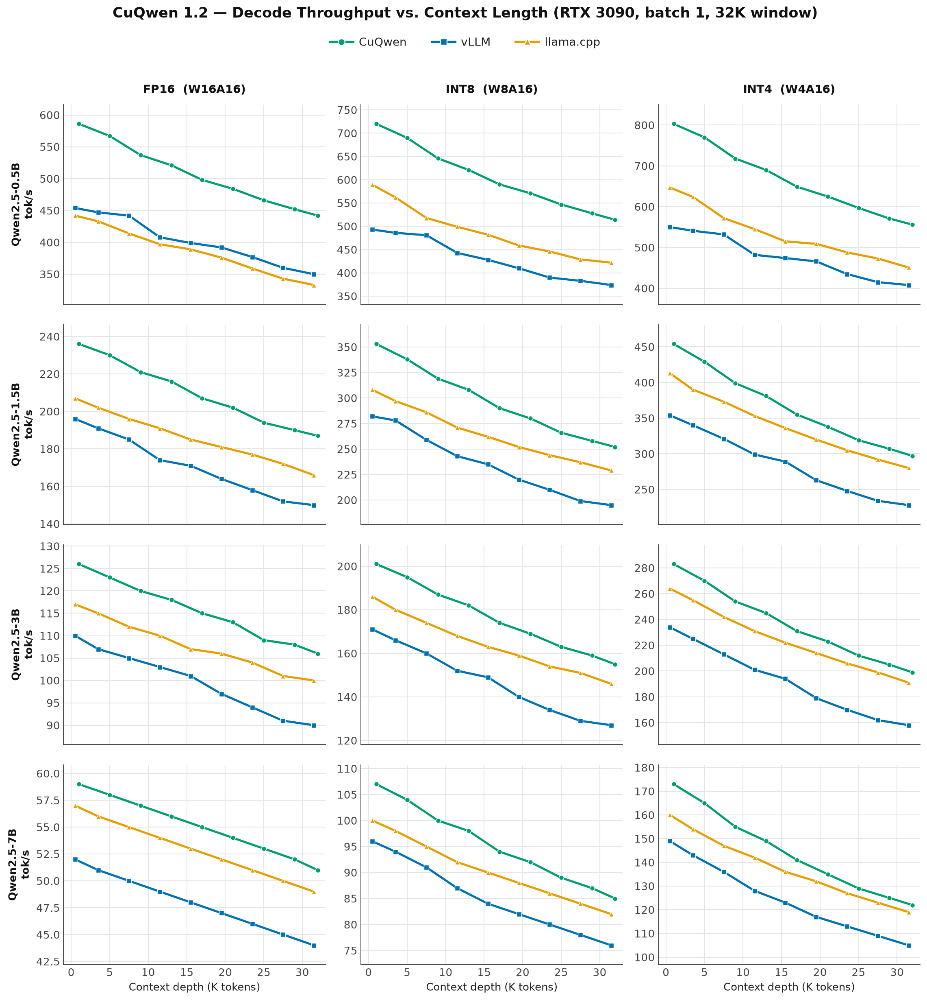
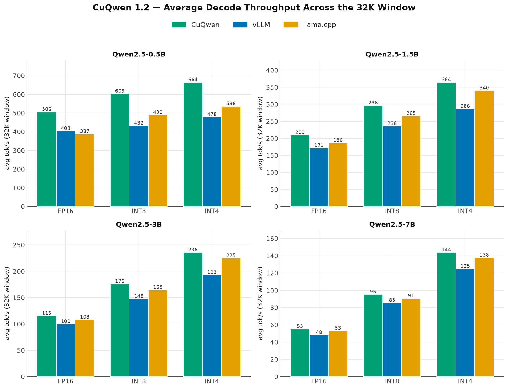
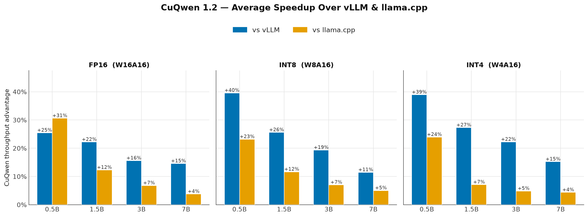
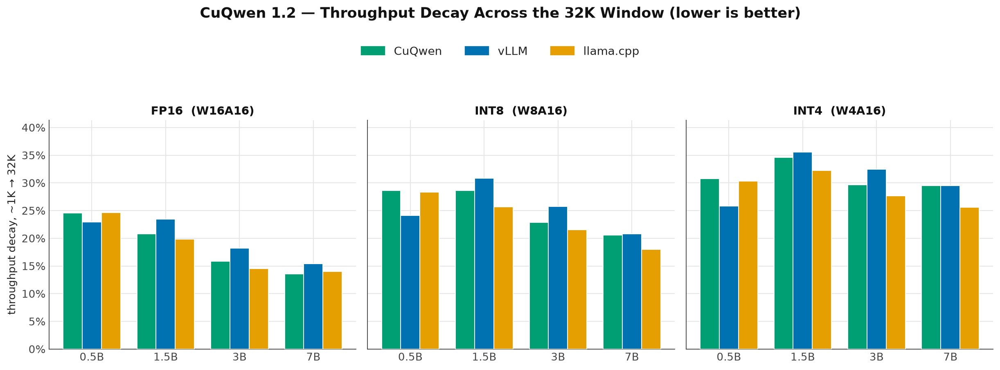

# CuQwen 1.2 Benchmark Analysis

This document details the benchmarking methodology, hardware configuration, and performance analysis comparing **CuQwen 1.2** against industry-standard inference frameworks (**vLLM** and **llama.cpp**) across the full 32K context window, in all three supported weight precisions: **FP16 (W16A16)**, **INT8 (W8A16)**, and **INT4 (W4A16)**.

---

## Benchmarking Strategy & Hardware Setup

CuQwen 1.2 was tested head-to-head against vLLM and llama.cpp on the **Qwen2.5** model family (`0.5B`, `1.5B`, `3B`, `7B`), across all three precisions.

* **Hardware Target:** Cloud-rented **NVIDIA RTX 3090 (24GB VRAM)**, driver 580.
* **Precision (weights only):** FP16, INT8 (W8A16), and INT4 (W4A16). The **KV cache stays FP16** on every engine — only the linear-projection weights are quantized.
  * **CuQwen:** symmetric per-group (128) weights-only quantization, dequantized to FP16 in-kernel.
  * **vLLM:** official GPTQ weights (`Qwen2.5-<S>-Instruct-GPTQ-Int8` / `-Int4`).
  * **llama.cpp:** official GGUF weights (`q8_0` / `q4_0`), measured via the native `llama-bench` (CUDA graphs + FlashAttention, all layers on GPU).
* **Batch Size:** Fixed at `1` (single-user interactive latency) — the regime where llama.cpp is strongest and vLLM's continuous batching is not exercised.
* **Context Window & Sampling:** Decode throughput sampled at **9 context depths** spanning the **32K window**. Prefill is excluded on all engines, so each figure is steady-state decode speed at that depth.
---

## Benchmark Analysis

### 1. Throughput vs. Context Length (Context Decay)

Across all four model sizes and all three precisions, **CuQwen holds the highest decode throughput at every sampled depth** — it is never overtaken by vLLM or llama.cpp within the 32K window. Quantization lifts the whole curve (INT4 runs roughly `1.3×` the FP16 rate, INT8 about `1.1–1.4×`) while the long-context decay path from 1.1 keeps the curve shape controlled rather than collapsing at depth.

---

### 2. Average Throughput Across the 32K Window

Averaged over the 9 sampled depths, **CuQwen posts the highest throughput in all 12 configurations**. The quantization gains are substantial and consistent — e.g. Qwen2.5-0.5B climbs `506 → 603 → 664` tok/s and Qwen2.5-7B `55 → 95 → 144` tok/s going FP16 → INT8 → INT4 — so even the 7B model clears 140 tok/s at 4-bit on a single RTX 3090.

---

### 3. Average Speedup Advantage

CuQwen's lead is largest exactly where custom single-batch kernels matter most — **small, quantized models** — peaking at **+39.6%** over vLLM (0.5B INT8) and **+30.6%** over llama.cpp (0.5B FP16). llama.cpp's native `llama-bench` is a strong batch-1 baseline, so CuQwen's margin over it narrows on the larger models (**+3.8–7.1%** on 3B/7B) while staying wide over vLLM (**+11.5–27.3%**) across every size and precision.

---

### 4. Performance Decay Rate (first → last sampled depth)

For every model, **decay grows as the weights shrink** (FP16 decays least, INT4 most). Once quantization cuts the weight-load cost, the **FP16 KV-cache attention** — which grows with context — becomes a larger share of per-token work, so the relative drop over the window increases. This is the expected trade-off of weights-only quantization with an FP16 cache, and motivates the planned KV-cache quantization. CuQwen's decay tracks vLLM closely (and is lower on the 1.5B/3B models at every precision); llama.cpp shows the flattest curves overall.

---

## Key Performance Findings

1. **Highest average throughput in all 12 configurations.** CuQwen 1.2 leads vLLM and llama.cpp on every model size at every precision across the 32K window.
2. **Quantization delivers the expected bandwidth wins.** INT8 and INT4 lift decode throughput substantially (e.g. `0.5B`: 506 → 603 → 664 tok/s for FP16 → INT8 → INT4) while keeping the long-context curve controlled.
3. **Strongest where single-batch kernels matter most** — small and quantized models, with up to **+39.6%** over vLLM and **+30.6%** over llama.cpp.
4. **Decay is the honest trade-off of weights-only quantization.** Lower-precision weights make the FP16 KV-cache attention term relatively larger, so INT4 decays fastest; KV-cache quantization is the next lever to flatten it.
